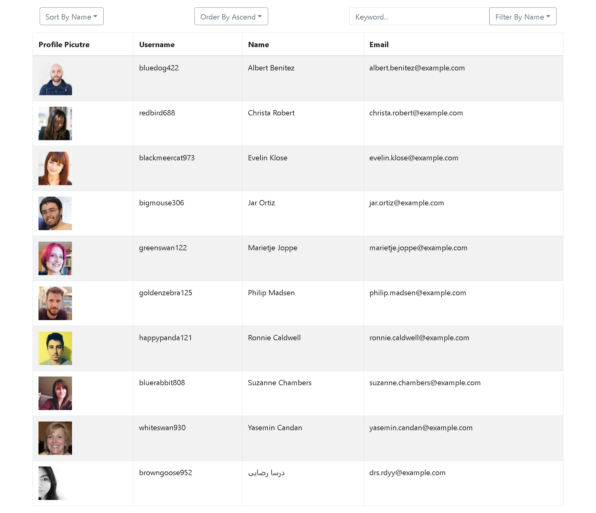

# Employee Directory
This application displays a table of employee directory. With the properties selected, User can sort these entries, and also filter them when keyword is given. A third party API [Random User API](https://randomuser.me/) is used in populating entries.

## Screenshot

## Live URL
https://alex-fok.github.io/Employee-Directory/